# Aprendendo Spring Boot
#### Aqui vou estar documentando conceitos novos que estou aprendendo com o curso de Spring Boot da Alura.

---

## @Controller:


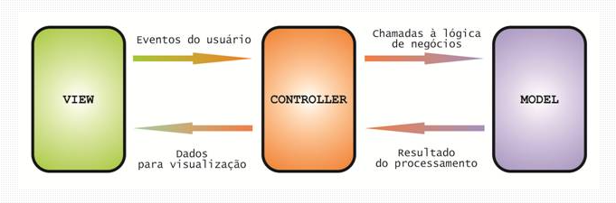 


Sua função é ser uma camada intermediária entre a camada de apresentação (View) e a camada de negócios (Model).
O controlador serve como um intermediário que organiza os eventos da interface com usuário e os direciona para a camada de modelo, assim, torna-se possível um reaproveitamento da camada de modelo em outros sistemas já que não existe dependência entre a visualização e o modelo.
Esta é uma classe de controlador (controller) simples que contém métodos para manipular solicitações HTTP para diferentes URLs.


Links para saber mais: 
- [Diferença entre @RestController e @Controller Annotation no Spring MVC e REST](https://medium.com/@gcbrandao/diferen%C3%A7a-entre-restcontroller-e-controller-annotation-no-spring-mvc-e-rest-8533998a93eb)
- [Top 10 Spring MVC and REST Annotations para programadores Java](https://medium.com/@gcbrandao/top-10-spring-mvc-and-rest-annotations-para-programadores-java-989735894f43)
- [Padrão MVC - Java Magazine](https://www.devmedia.com.br/padrao-mvc-java-magazine/21995#5)

## @RequestMapping

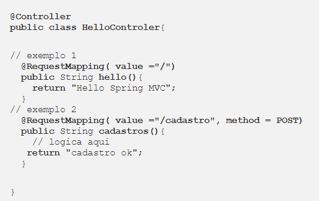 

A classe Controller contém vários métodos manipuladores para manipular as diferentes solicitações HTTP, mas como o Spring mapeia uma solicitação específica para um método manipulador específico? Bem, isso é feito com a ajuda da annotation @RequestMapping. É uma annotation no nível do método que é colocada sobre um método.
Define a url que quando for requisitada chamara o metodo.
## O que é persistencia de dados?

Podemos entender o que é persistência de dados como a garantia de que um dado foi salvo e que poderá ser recuperado quando necessário no futuro. Esse conceito existe na computação para referenciar o ato de salvar os dados. Mantendo o registro de dados processados pelos sistemas, e transformando-os em dados persistentes, geramos insumos para análises futuras que vão possibilitar a tomada de decisões estratégicas por empresas para alavancar seus negócios. O mais usual é utilizar um banco de dados, mas nada impede que sejam utilizadas outras ferramentas, como uma planilha no Excel, um arquivo de texto, etc. Tudo depende do propósito dos dados persistentes e de seu contexto.
No entanto, caso seja necessário fazer uma boa análise de dados, é interessante que os dados estejam armazenados em locais que te darão maior poder de recuperação e organização, por isso a recomendação de utilizar um bom banco de dados.

Uma dificuldade que temos de enfrentar é que, apesar da padronização do SQL, cada banco tem suas peculiaridades, com instruções próprias e tipos de colunas diferentes, o que pode tornar bastante trabalhoso migrar de um banco para outro, dado que sua aplicação já está específica para um determinado banco.

Visando diminuir essa dificuldade de transição entre os bancos de dados, temos a JPA. Ela é uma API baseada no conceito de ORM (Object-Relational Mapping ou Mapeamento Objeto-Relacional, onde as tabelas do banco de dados são representadas através de classes e os registros de cada tabela são representados como instâncias das classes correspondentes.) e funciona como uma camada de abstração entre a aplicação e o banco de dados, possibilitando uma maior independência entre os mesmos.

Com ORM, o desenvolvedor passa a usar, ao inves de comandos SQL, uma interface de programação, não sendo necessário uma correspondência direta entre tabelas do banco de dadoss e classes Java.

Para tal são necessários metadados para essa persistência. Esses metadados podem ser desenvolvidos utilizando-se arquivos XML, Java annotations ou ambos.

Com annotations, por exemplo, você poderá ter em sua classe indicadores de que aquela classe esta sofrendo persistência (Entity) ou de que seus métodos são colunas de uma determinada tabela , como observado abaixo, nesse exemplo:

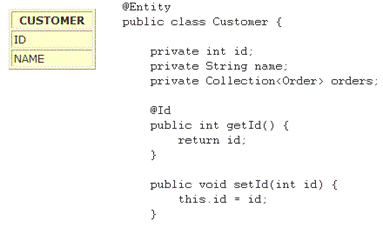 

Por default, o nome de uma tabela corresponde ao nome da classe, mas isto pode ser mudado com uso de @Table(name="MYNEWTABLE"). O mesmo acontece com as colunas, onde cada field sera mapeado com o nome de uma coluna. Tambem pode ser mudado utilizando-se @Column(name="mynewColumn”). O uso de @Id define que aquele  atributo está mapeado e corresponde à chave primária da tabela. Se usarmos juntamente a @GeneratedValue, teremos um valor gerado automaticamente.

E, se estamos falando de banco de dados, também teremos annotations para desmostrar o relacionamento, como @OneToOne,  @OneToMany, @ManyToOne e @ManyToMany.


Links para saber mais: 
- [Entenda o que é persistência de dados](https://www.javaavancado.com/entenda-o-que-e-persistencia-de-dados/)
- [Persistência de dados: tudo que você precisa saber sobre conceito, tipos e técnicas](https://www.take.net/blog/tecnologia/persistencia-de-dados/?unapproved=27597&moderation-hash=614738c1d4e3643a579952aa8c2ec3c8#comment-27597)
- [Persistindo dados em Java com JPA](https://www.devmedia.com.br/persistindo-dados-em-java-com-jpa/29797)
- [Persistência em Java com API JPA](http://www.linhadecodigo.com.br/artigo/2525/persistencia-em-java-com-api-jpa.aspx)


## @ResponseBody

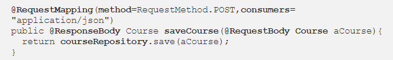 

Essa annotation é usada para transformar um objeto Java retornado do controller em uma representação de recurso solicitada por um cliente REST. Precisamos anotar cada método que gera resposta REST com a anotação @ResponseBody.

## DTO – Objeto de Transferencia de Dados

Padrão Objeto de Transferência de Dados (do inglês, Data transfer object design pattern, ou simplesmente DTO) é um padrão de arquitetura de objetos que agregam e encapsulam dados para transferência.

Diferente do que ocorre com os objetos de negócio e os objetos de acesso a dados (DAO), o DTO não possui qualquer tipo de comportamento. A sua função é obter e armazenar dados. Quando estamos trabalhando com uma interface remota, cada chamada ao servidor pode custar muito tempo de processamento, a depender da quantidade de dados. Com o DTO, podemos filtrar quais dados serão transmitidos e assim reduzir esse problema.

O DTO é bastante utilizado também quando não queremos expor todos os dados da nossa camada de persistência mas precisamos exibir ao nosso cliente estes mesmos dados.

Links para saber mais:
- [Design Patterns - DTO](https://javabahia.github.io/falando-sobre-dto/)


## stream

A Streams API traz uma nova opção para a manipulação de coleções em Java seguindo os princípios da programação funcional. Combinada com as expressões lambda, ela proporciona uma forma diferente de lidar com conjuntos de elementos, oferecendo ao desenvolvedor uma maneira simples e concisa de escrever código que resulta em facilidade de manutenção e paralelização sem efeitos indesejados em tempo de execução.

A paralelização de operações consiste basicamente em dividir uma tarefa maior em subtarefas menores, processar essas subtarefas em paralelo e, em seguida, combinar os resultados para obter o resultado final. Em sua estrutura, a API de Streams fornece um mecanismo similar para trabalhar com a Java Collections, convertendo a coleção em uma stream, em um primeiro momento, processando os vários elementos em paralelo em seguida e, por fim, reunindo os elementos resultantes em uma coleção.

Exemplo: encontrar em uma lista de ordens de serviço todas aquelas que estão relacionadas à ativação, por exemplo, de um serviço de telefonia, e por fim retornar todos os identificadores dessas ordens classificados de maneira decrescente segundo o valor cobrado pelo serviço.

Antes do stream:
````
List<Ordem> OrdensAtivacao = new Arraylist<>();
for(Ordem o: ordens){    
  if(o.getType() == Ordem.ATIVACAO) {  
    OrdensAtivacao.add(t); 
    } 
  }
Collections.sort(OrdensAtivacao, new Comparator(){ 
  public int compare(Ordem t1, Ordem t2){          
    return t2.getValue().compareTo(t1.getValue());      
  }
});
List<Integer> ordensIDs = new ArrayList<>();
for(Ordem o: OrdensAtivacao){      
  ordensIDs.add(t.getId());
}
````

Depois do stream:
````
List<Integer> ordensIDs =    Ordem.stream()
               .filter(o -> o.getType() == Ordem.ATIVACAO)
               .sorted(comparing(Ordem::getValue).reversed())
               .map(Ordem::getId)
               .collect(toList());
````

Primeiramente, obtemos uma stream da lista de dados usando o método stream(), da interface Collection. Depois, uma série de operações são aplicadas. O método filter(), por exemplo, retorna apenas as ordens que são do tipo ATIVACAO. Sua saída é processada pela operação sorted(), que ordenará as operações de forma decrescente levando em consideração o valor da operação. Em seguida, o resultado de sorted() será manipulado pelo método map(), que obterá todas as informações que desejamos, ou seja, todos os identificadores das ordens da lista de operações. Por fim, o método collect() devolve uma lista de inteiros, em oposição aos demais, que sempre retornam uma nova stream como resultado do processamento.

Em uma coleção é possível navegar até os elementos de diferentes maneiras, tanto de forma sequencial quanto por meio de índices. Já em uma Stream o acesso aos elementos é sequencial, não sendo possível alcançá-los através de índices, pois inexiste uma estrutura de dados para armazenar os elementos que, por sua vez, são processados sob demanda.
 
Outro diferencial é verificado quando se tem a necessidade de manipular grandes quantidades de dados. Nesses casos a Streams API oferece a possibilidade de trabalhar com esses dados de forma paralela, viabilizando uma melhora de desempenho ao tirar proveito do poder de processamento dos computadores modernos.

Tomando como exemplo o código acima, para que o desenvolvedor consiga fazer uso da paralelização, basta trocar o método stream() por parallelStream(). Dessa forma a Streams API irá decompor as ações em várias subtarefas, e as operações serão processadas em paralelo, explorando os recursos oferecidos pelos diversos núcleos do processador.

Em suma, a Streams API trabalha convertendo uma fonte de dados em uma Stream. Em seguida, realiza o processamento dos dados através das operações intermediárias e, por fim, retorna uma nova coleção ou valor reduzido (map-reduce) com a chamada a uma operação terminal.

Links para saber mais: 
- [Java 8: Iniciando o desenvolvimento com a Streams API](https://www.oracle.com/br/technical-resources/articles/java-stream-api.html)

## Method References

You use lambda expressions to create anonymous methods. Sometimes, however, a lambda expression does nothing but call an existing method. In those cases, it's often clearer to refer to the existing method by name. Method references enable you to do this; they are compact, easy-to-read lambda expressions for methods that already have a name.

Kind | Syntax
--------- | ------
Reference to a static method | ContainingClass :: staticMethodName
Reference to an instance method of a particular object | containingObject :: instanceMethodName
Reference to an instance method of an arbitrary object of a particular type	    | ContainingType :: methodName	
Reference to a constructor	  | ClassName :: new	

````
public class MethodReferencesExamples {
    
    public static <T> T mergeThings(T a, T b, BiFunction<T, T, T> merger) {
        return merger.apply(a, b);
    }
    
    public static String appendStrings(String a, String b) {
        return a + b;
    }
    
    public String appendStrings2(String a, String b) {
        return a + b;
    }
````
````
MethodReferencesExamples myApp = new MethodReferencesExamples();

// Reference to a static method
MethodReferencesExamples::appendStrings

// Reference to an instance method of a particular object  
myApp::appendStrings2

// Reference to an instance method of an arbitrary object of a particular type
String::concat

// Reference to a constructor
HashSet::new
````

Links para saber mais: 
- [Method References](https://docs.oracle.com/javase/tutorial/java/javaOO/methodreferences.html)

## ENUM

São tipos de campos que consistem em um conjunto fixo de constantes (static final), sendo como uma lista de valores pré-definidos. Na linguagem de programação Java, pode ser definido um tipo de enumeração usando a palavra chave enum.

Todos os tipos enums implicitamente estendem a classe java.lang.Enum, sendo que o Java não suporta herança múltipla, não podendo estender nenhuma outra classe.

Declaração de Enum, com construtor e métodos:

````
public enum OpcoesMenu {
SALVAR(1), IMPRMIR(2), ABRIR(3), VISUALIZAR(4), FECHAR(5);

private final int valor;
OpcoesMenu(int valorOpcao){
valor = valorOpcao;
}
public int getValor(){
return valor;
}
}
````

Links para saber mais:
- [Tipos Enum no Java](https://www.devmedia.com.br/tipos-enum-no-java/25729)

## REST (Representational State Transfer)

Tem como objetivo primário a definição de características fundamentais para a construção de aplicações Web seguindo boas práticas.

### Recursos
Um recurso é um elemento abstrato e que nos permite mapear qualquer coisa do mundo real como um elemento para acesso via Web.

Exemplo:
- Alunos
- Cursos

### Identificador de recursos (URI)

- Alunos (/alunos)
- Cursos (/cursos)

### Manipulação de recursos (Verbos HTTP)

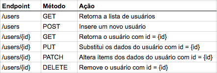 

Para interagirmos com os recursos, o HTTP nos fornece uma interface de operações padronizadas, permitindo que possamos criar, atualizar, pesquisar, remover e executar operações sob um determinado recurso.

- GET: (/alunos) O método GET é utilizado quando existe a necessidade de se obter um recurso. Em caso de sucesso, retorna uma representação em JSON e um código de resposta HTTP de 200 (OK). Em caso de erro, ele geralmente retorna um 404 (NOT FOUND) ou 400 (BAD REQUEST). 

De acordo com o design da especificação HTTP, requisições GET (juntamente com HEAD) são usadas apenas para ler dados e jamais alterá-los. Portanto, quando usados dessa forma, são considerados seguros.
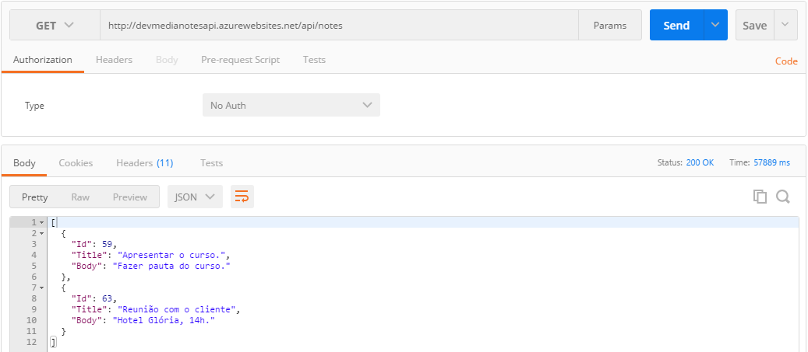 
Get com parametro:
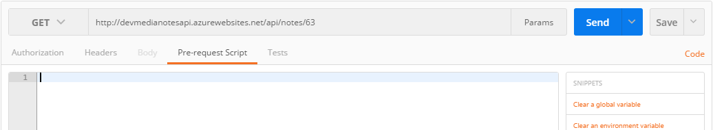

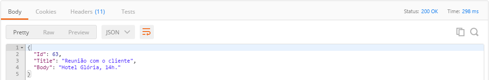 

- POST: (/alunos) Utilizamos o método POST quando desejamos criar algum recurso no servidor a partir de uma determinada representação. Na criação bem-sucedida, retornar o status HTTP 201. 

Ele não é um método seguro, pois altera o estado do recurso no servidor. Ele também não é idempotente, o que quer dizer que se ele for executado duas vezes de forma idêntica serão criados dois itens diferentes com o mesmo conjunto de dados.

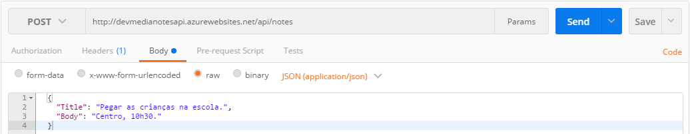 

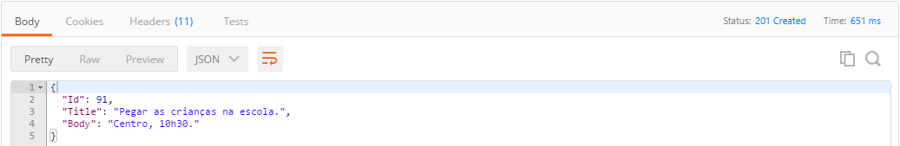 

- PUT: (/alunos/{id}) PUT é mais utilizado para substituir (ou atualizar) recursos, executando a requisição para uma URI de recurso conhecido, com o corpo da requisição contendo a representação recém-atualizada do recurso original.

Na atualização bem-sucedida, retorna 200 (ou 204 se não retornar qualquer conteúdo no corpo). Retornar os dados do recurso no corpo é opcional, lembrando que fazer isso causa maior consumo de banda.

PUT não é uma operação segura, pois modifica estado no servidor, mas é idempotente. Em outras palavras, se você atualizar um recurso usando PUT e, em seguida, fazer essa mesma chamada novamente, o recurso ainda está lá e ainda tem o mesmo estado.

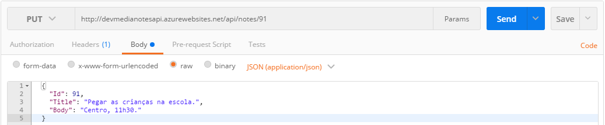 

- DELETE: (/alunos/{id}) Como você já deve estar imaginando, o método DELETE é utilizado com o intuito de remover um recurso em um determinado servidor. Na exclusão bem-sucedida, devolve o status HTTP 200 (OK) ou o status HTTP 204 (NO CONTENT) sem corpo de resposta.

Operações DELETE são idempotentes.

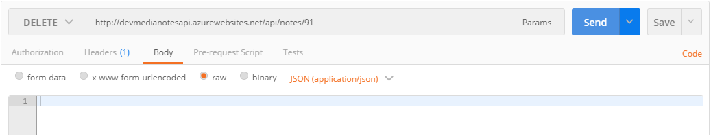 

### Respostas

Baseado nos métodos que discutimos, o servidor deve processar cada uma das requisições e retornar uma resposta adequada. Veja um resumo de cada uma dessas respostas.

1XX – Informações Gerais

2XX – Sucesso

3XX – Redirecionamento

4XX – Erro no cliente

5XX – Erro no servidor


Para saber mais:
- [HTTP: Verbos](https://www.devmedia.com.br/http-verbos/41224)
- [4 Conceitos sobre REST que Qualquer Desenvolvedor Precisa Conhecer](https://blog.algaworks.com/4-conceitos-sobre-rest-que-qualquer-desenvolvedor-precisa-conhecer/)
- [API Rest e os verbos HTTP](https://blog.mbeck.com.br/api-rest-e-os-verbos-http-46e189085e21)

## Spring Data JPA

Adicionando no pom.xml:

````
<dependency>
	<groupId>org.springframework.boot</groupId>
	<artifactId>spring-boot-starter-data-jpa</artifactId>
</dependency>
````
(por padrão usa o Hibernate)

````
<dependency>
	<groupId>com.h2database</groupId>
	<artifactId>h2</artifactId>
</dependency>
````
O H2 é um banco de dados Open Source que funciona em memória com um console acessível pelo browser dentro do contexto da aplicação.

Adicionar em main/resources/application.properties:
````
# datasource 
spring.datasource.driverClassName=org.h2.Driver
spring.datasource.url=jdbc:h2:mem:alura-forum
spring.datasource.username=sa
spring.datasource.password=

# jpa 
spring.jpa.database-platform=org.hibernate.dialect.H2Dialect
spring.jpa.hibernate.ddl-auto=update

# h2
spring.h2.console.enabled=true
spring.h2.console.path=/h2-console
````

## @Entity
A anotação @Entity é utilizada para informar que uma classe também é uma entidade. A partir disso, a JPA estabelecerá a ligação entre a entidade e uma tabela de mesmo nome no banco de dados, onde os dados de objetos desse tipo poderão ser persistidos.

Uma entidade representa, na Orientação a Objetos, uma tabela do banco de dados, e cada instância dessa entidade representa uma linha dessa tabela.

Exemplo:
````
@Entity
public class Produto {

}
````


Para saber mais: 
- [JPA: Como usar a anotação @Entity](https://www.devmedia.com.br/jpa-como-usar-a-anotacao-entity/38410)

## @GeneratedValue

A anotação @GeneratedValue é utilizada para informar que a geração do valor do identificador único da entidade será gerenciada pelo provedor de persistência. Essa anotação deve ser adicionada logo após a anotação @Id. Quando não anotamos o campo com essa opção, significa que a responsabilidade de gerar e gerenciar as chaves primárias será da aplicação, em outras palavras, do nosso código, como vemos no exemplo a seguir:

````
@Entity
public class Produto {

  @Id @GeneratedValue
  private long id;

}
````
Com o código deste exemplo, a JPA passará a utilizar a estratégia de geração de chave primária do banco de dados ao qual a aplicação está conectada.

Estratégia | Descrição
--------- | ------
GenerationType.AUTO | Valor padrão, deixa com o provedor de persistência a escolha da estratégia mais adequada de acordo com o banco de dados.
GenerationType.IDENTITY | Informamos ao provedor de persistência que os valores a serem atribuídos ao identificador único serão gerados pela coluna de auto incremento ([o que é auto incremento](http://www.bosontreinamentos.com.br/mysql/mysql-auto-incremento-de-valores-em-colunas-08/)) do banco de dados. Assim, um valor para o identificador é gerado para cada registro inserido no banco. Alguns bancos de dados podem não suportar essa opção.
GenerationType.SEQUENCE  | Informamos ao provedor de persistência que os valores serão gerados a partir de uma sequence ([o que é sequence](https://consultabd.wordpress.com/2019/11/22/sequence/)). Caso não seja especificado um nome para a sequence, será utilizada uma sequence padrão, a qual será global, para todas as entidades. Caso uma sequence seja especificada, o provedor passará a adotar essa sequence para criação das chaves primárias. Alguns bancos de dados podem não suportar essa opção.
GenerationType.TABLE  | Com a opção TABLE é necessário criar uma tabela para gerenciar as chaves primárias. Por causa da sobrecarga de consultas necessárias para manter a tabela atualizada, essa opção é pouco recomendada.

Exemplo:
````
@Entity
public class Produto {

@Id
@GeneratedValue(strategy=GenerationType.IDENTITY)
    private long id;

    private String nome;

    //getters e setters omitidos

}
````
